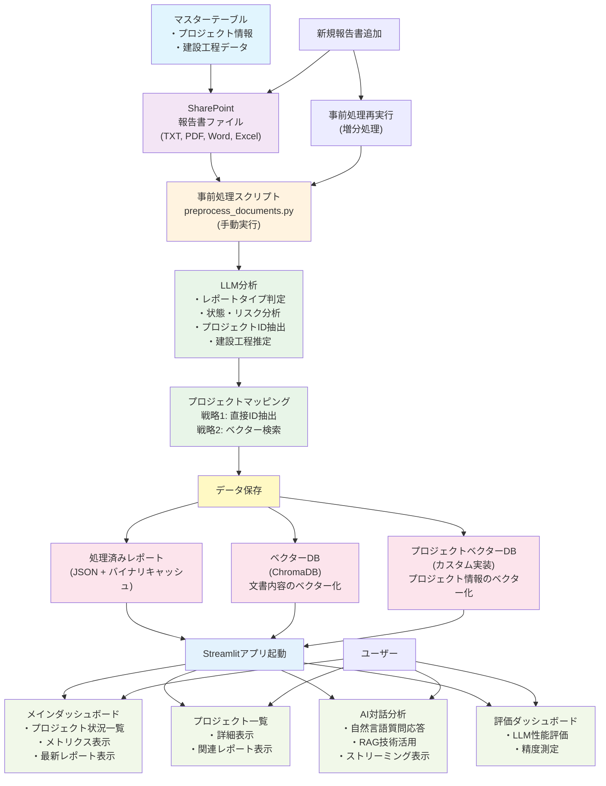

# 建設管理システム連動LLMアプリケーション

## 概要

このアプリケーションは、建設工程管理システム（auRora, Synapse）と連動したLLMベースの分析ツールです。SharePointに保存された建設レポートを自動的に分析し、トラブルや異常事象を検知して適切な分類・報告を行います。

## システム全体像

以下の図は、データの流れと各コンポーネントの関係を示しています：



### データフローの説明

1. **データ入力**: マスターテーブルとSharePoint報告書ファイルが入力源
2. **事前処理**: 手動実行される処理スクリプトがファイルを分析
3. **LLM分析**: 統合分析により全項目を一度に抽出
4. **プロジェクトマッピング**: 複数戦略でレポートをプロジェクトに紐付け
5. **データ保存**: 処理結果を複数形式で保存（高速アクセス用）
6. **アプリケーション**: Streamlitベースの各種ダッシュボード
7. **増分処理**: 新規報告書追加時の効率的な更新

### 主な機能

- **多形式文書の自動読み込み** (TXT, PDF, Word, Excel)
- **統合LLM分析** (1回の呼び出しで全項目抽出・複数プロバイダー対応)
- **マルチ戦略プロジェクトマッピング** (直接ID抽出 + ベクター検索)
- **セマンティック検索** (ChromaDBベクターストア + カスタムプロジェクト検索)
- **包括的品質分析** (レポートタイプ・状態・カテゴリ・リスク・分析困難度)
- **自然言語による質問応答** (RAG技術・ストリーミング対応・思考過程表示)
- **プロジェクト中心ダッシュボード** (展開式レポート表示・スクロール最適化)
- **定量的評価システム** (統合分析性能・プロジェクトマッピング精度評価)

### 技術的特徴

#### 建設業界特化AI
- 専門用語の理解（内諾、免許申請、理事会NG等）
- 工程文脈の把握（時系列での状況変化）
- auRora/Synapse特有の表記ルール学習

#### 統合LLM分析アーキテクチャ
- **1回の呼び出しで完全分析**: レポートタイプ・状態・カテゴリ・リスク・プロジェクトID・建設工程・分析困難度
- **フォールバック削除**: 品質の悪いフォールバック処理を廃止し、LLM出力の純度向上
- **67%の処理時間削減**: 3回→1回のLLM呼び出しによる高速化
- **シンプルなエラー処理**: 失敗は失敗として記録、データ品質の透明性向上

#### 智能プロジェクトマッピング
- **戦略1**: 直接ID抽出（LLMによる工事番号・プロジェクトIDの認識）
- **戦略2**: ベクター検索（セマンティック類似度によるプロジェクト特定）
- **カスタムベクターストア**: 高速なプロジェクトマスター検索（pickle + NumPy）
- **信頼度スコア**: ダイレクトマッピング（1.0）+ ベクター類似度

#### 説明可能AI (XAI)
- **分析信頼度**: LLMが自身の分析確実性を0.0-1.0で自己評価
- **分析困難検知**: LLMが「人間確認が必要」と判断したケースの自動フラグ
- **品質監視**: 想定外値やバリデーション問題の詳細記録

#### 高性能アーキテクチャ
- **事前処理 + リアルタイム分離**: バックグラウンド処理で高速UI
- **バイナリキャッシュ**: 40-100倍の高速データ読み込み
- **並列処理**: マルチスレッドによる効率的な文書処理
- **メモリ最適化**: カスタムベクターストアによる軽量化

---

## セットアップ手順

### 前提条件

1. **Python 3.9以上** がインストールされていること
2. **Ollama** がインストールされ、`llama3.3:latest`モデルが利用可能であること

```bash
# Ollamaのインストール確認
ollama list
# llama3.3:latest が表示されることを確認
```

### 1. リポジトリのクローン

```bash
git clone <your-repository-url>
cd eng-llm-app
```

### 2. Python仮想環境の作成・アクティベート

```bash
# 仮想環境作成
python3 -m venv venv

# 仮想環境をアクティベート
# Linux/Mac:
source venv/bin/activate

# Windows:
venv\\Scripts\\activate
```

### 3. 依存関係のインストール

```bash
pip install --upgrade pip
pip install -r requirements.txt
```

### 4. 環境変数の設定（オプション）

```bash
# 環境変数ファイルをコピー
cp env.example .env

# 必要に応じて .env ファイルを編集（OpenAI、Anthropicの API キー等）
```

### 5. 事前処理の実行（初回必須）

```bash
# 初回セットアップ: 全ファイルを事前処理
python scripts/preprocess_documents.py --force

# 処理状況を詳細ログ付きで確認
python scripts/preprocess_documents.py --force --verbose
```

### 6. アプリケーションの起動

```bash
# メインダッシュボードを起動
python -m streamlit run app/main.py
```

### 7. ブラウザでアクセス

アプリケーションが起動すると、自動的にブラウザが開きます。
開かない場合は以下のURLにアクセスしてください：

```
http://localhost:8501
```

---

## 事前処理システム

### 概要
実運用を想定した事前処理とリアルタイム処理の分離設計を実装。ファイル単位での増分処理に対応し、効率的な運用が可能。

### 設計思想
**事前処理（バックグラウンド）**
- レポート投入時に実行
- ベクター化、LLM分析、フラグ分類、異常検知、リスクレベル判定
- **ファイル単位での管理**: 新規ファイルのみ処理、既存ファイルはスキップ
- **変更検出**: ファイルハッシュによる変更自動検出
- **バイナリキャッシュ**: 高速読み込み用の最適化データ生成

**リアルタイム処理（ダッシュボード）**
- 起動時は事前処理済みデータを読み込み（高速）
- プログレス表示による美しいユーザー体験
- ユーザー操作時のみLLMを使用（質問対応、データ更新）

### 事前処理の実行コマンド

```bash
# 増分処理（推奨）- 新規・変更ファイルのみ処理
python scripts/preprocess_documents.py

# 全ファイル強制再処理
python scripts/preprocess_documents.py --force

# 特定ファイルのみ処理
python scripts/preprocess_documents.py --file report_021_new_issue.txt

# 特定のLLMプロバイダーを指定
python scripts/preprocess_documents.py --provider openai
python scripts/preprocess_documents.py --provider anthropic

# 詳細ログ付きで実行
python scripts/preprocess_documents.py --verbose

# 組み合わせ例
python scripts/preprocess_documents.py --provider openai --force --verbose
```

### 処理ステータス
- **成功**: 正常に処理完了
- **スキップ**: 既に処理済み（変更なし）
- **失敗**: エラーが発生

### データ構造
```
data/
├── processed_reports/          # ファイル単位の処理結果
│   ├── index.json             # 処理状況管理ファイル
│   ├── report_001_antenna_tower_opposition.json    # JSON結果
│   ├── report_001_antenna_tower_opposition.cache   # バイナリキャッシュ
│   └── ...                    # 各ファイルの処理結果
└── evaluation/
    └── ground_truth.json      # 評価用正解データ
```

---

## 評価システム

### 概要
LLMの機能を定量的に評価するための専用ダッシュボードです。

### 評価対象機能
- **状態分類**: 工事の状況（正常、遅延リスク低/高、停止）
- **カテゴリ分類**: 問題の原因（技術課題、事務課題、環境課題）
- **リスクレベル評価**: 緊急度（低、中、高）
- **異常検知**: 問題レポートの自動検出

### 評価指標
- **精度 (Accuracy)**: 全体の正解率
- **適合率 (Precision)**: 検出した問題の正確性
- **再現率 (Recall)**: 実際の問題の検出率
- **F1スコア**: 適合率と再現率の調和平均

### 評価ダッシュボードの起動

```bash
# 仮想環境をアクティベート
source venv/bin/activate

# 評価専用ダッシュボードを起動
python -m streamlit run app/evaluation_dashboard.py --server.port 8504
```

ブラウザで http://localhost:8504 にアクセス

---

## プロジェクト構造

```
eng-llm-app/
├── app/                          # メインアプリケーション
│   ├── main.py                   # Streamlitメインアプリ
│   ├── evaluation_dashboard.py   # 評価専用ダッシュボード
│   ├── models/                   # データモデル
│   │   ├── construction.py       # 建設工程モデル
│   │   └── report.py             # レポートモデル
│   ├── services/                 # ビジネスロジック
│   │   ├── llm_service.py        # LLM連携サービス
│   │   ├── vector_store.py       # ベクターストア管理
│   │   ├── document_processor.py # ドキュメント処理
│   │   └── evaluation_service.py # 評価システム
│   ├── ui/                       # UI コンポーネント
│   │   ├── dashboard.py          # ダッシュボード
│   │   ├── report_viewer.py      # レポート表示
│   │   └── analysis_panel.py     # 分析結果表示
│   ├── utils/                    # ユーティリティ
│   │   ├── cache_loader.py       # バイナリキャッシュローダー
│   │   └── streaming_loader.py   # ストリーミング読み込み
│   └── config/                   # 設定ファイル
│       ├── settings.py           # アプリ設定
│       └── prompts.py            # LLMプロンプトテンプレート
├── scripts/                      # 事前処理スクリプト
│   └── preprocess_documents.py   # 事前処理メインスクリプト
├── data/                         # データ
│   ├── sharepoint_docs/          # SharePoint想定ドキュメント
│   ├── processed_reports/        # 事前処理結果（自動生成）
│   └── evaluation/               # 評価データ
├── vector_store/                 # ベクターストア（自動生成）
├── venv/                         # Python仮想環境
├── requirements.txt              # 依存関係
├── env.example                   # 環境変数テンプレート
└── README.md                     # このファイル
```

---

## 使用方法

### 1. プロジェクト管理ダッシュボード

- **プロジェクト中心設計**: 建設プロジェクト単位での管理・監視
- **タブ式プロジェクト表示**: 最新報告・緊急対応・通常監視のカテゴリ分類
- **展開式レポート詳細**: st.expanderによるスムーズな詳細表示（スクロール最適化済み）
- **リアルタイムメトリクス**: プロジェクト数・停止数・リスク分布を一目で把握
- **インタラクティブグラフ**: ステータス分布・問題区分・完了予定タイムライン

### 2. レポート一覧

- **フィルター機能**: レポートタイプ、リスクレベル、フラグ、緊急度による絞り込み
- **詳細表示**: 各レポートの分析結果、異常検知結果、プロジェクト情報
- **ソート機能**: 緊急度順での自動ソート

### 3. AI対話分析パネル

- **自然言語質問応答**: 建設工程に関する専門的な質問に対応
- **ストリーミング表示**: リアルタイムでのAI回答生成
- **思考過程表示**: AIの分析プロセスを可視化（オプション）
- **サンプル質問**: よくある質問のテンプレート提供
- **RAG技術**: ベクターストアを活用した高精度な回答生成

---

## 新しいフラグシステム

従来の単一フラグから、状態と原因を分離した新体系に移行：

**状態フラグ（ステータス）**
- `NORMAL`: 順調
- `DELAY_RISK_LOW`: 遅延リスク低
- `DELAY_RISK_HIGH`: 遅延リスク高
- `STOPPED`: 停止

**原因ラベル（カテゴリ）**
- `TECHNICAL`: 技術課題（設計変更、故障、工法問題）
- `ADMINISTRATIVE`: 事務課題（承認待ち、申請遅延、手続き問題）
- `EXTERNAL`: 環境課題（住民反対、天候、アクセス問題）
- `OTHER`: その他（要確認）

**リスクレベル**
- `低`: 軽微な課題
- `中`: 注意が必要
- `高`: 緊急対応必要

---

## 技術スタック

### AI/LLM技術
- **Ollama + llama3.3**: ローカルLLM実行環境
- **OpenAI GPT-4o**: クラウドLLM選択肢
- **Anthropic Claude Sonnet 4**: 高性能LLM選択肢
- **ChromaDB**: ベクターデータベース
- **mxbai-embed-large**: 高品質な日本語埋め込みモデル

### データ処理
- **PyPDF2/pypdf**: PDFファイル読み込み
- **python-docx**: Wordファイル読み込み  
- **openpyxl**: Excelファイル読み込み
- **pandas**: データ処理・分析
- **pickle**: 高速バイナリキャッシュ

### UI/可視化
- **Streamlit**: Webアプリケーションフレームワーク
- **Plotly**: インタラクティブなグラフ作成

### パフォーマンス最適化
- **ThreadPoolExecutor**: 並列処理
- **@st.cache_data**: Streamlitキャッシング
- **Binary Cache**: pickle による高速デシリアライゼーション

---

## トラブルシューティング

### よくある問題と解決方法

#### 1. Ollamaに接続できない

```bash
# Ollamaが起動しているか確認
ollama list

# 起動していない場合
ollama serve

# llama3.3モデルがない場合
ollama pull llama3.3:latest
```

#### 2. 事前処理が未実行

```bash
# 初回は必ず事前処理を実行
python scripts/preprocess_documents.py --force

# 処理状況の確認
ls -la data/processed_reports/
```

#### 3. 依存関係のインストールでエラー

```bash
# pipをアップグレード
pip install --upgrade pip

# 個別にインストールを試行
pip install streamlit
pip install chromadb
```

#### 4. メモリ不足エラー

```bash
# 軽量な設定で起動
export STREAMLIT_SERVER_MAX_UPLOAD_SIZE=200
streamlit run app/main.py
```

#### 5. ブラウザでアプリが開かない

```bash
# 手動でURLにアクセス
http://localhost:8501

# ポートが使用されている場合
python -m streamlit run app/main.py --server.port 8502
```

---

## 開発者向け情報

### カスタマイズ方法

#### 1. 新しいレポートタイプの追加

`app/models/report.py`の`ReportType`クラスに追加：

```python
class ReportType(Enum):
    CONSTRUCTION_REPORT = "建設工程報告書"
    TROUBLE_REPORT = "トラブル報告書"
    PROGRESS_UPDATE = "進捗更新報告"
    YOUR_NEW_TYPE = "新しいレポートタイプ"  # 追加
```

#### 2. プロンプトのカスタマイズ

`app/config/prompts.py`でLLMプロンプトを調整可能。

#### 3. 新しいLLMプロバイダーの追加

`app/services/llm_service.py`で新プロバイダーのクライアント実装を追加。

---